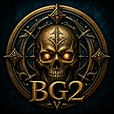
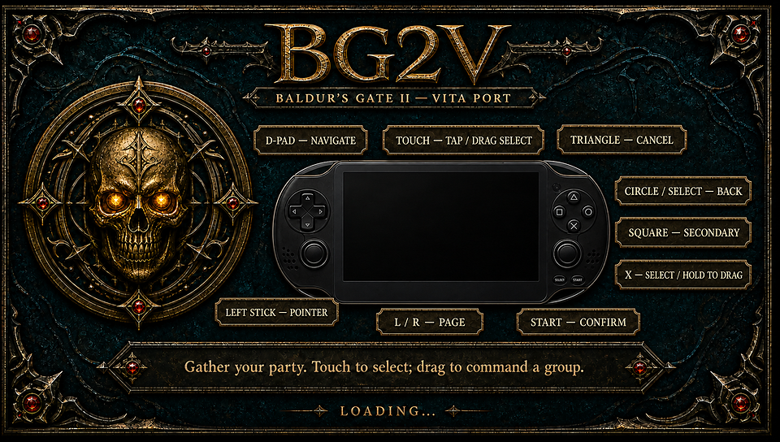

# BG2V

  

BG2V is a community-made PlayStation Vita port of **Baldur's Gate II:
Enhanced Edition**. It lets the game run on a homebrew-capable Vita with Vita
controls, touchscreen support, and Vita-optimized startup videos.

This project is a work in progress. Compatibility and performance may vary by
Vita and by Android game version.

## Installation

You need `BG2v0_beta.vpk`, your own Baldur's Gate II Android APK, the BG2V
Windows Setup package, and a homebrew-capable Vita with VitaShell.

1. Double-click **Prepare BG2V.bat** from the Windows Setup extracted folder.
2. Select your legally obtained Baldur's Gate II Android APK.
3. Wait for the success message.
4. Copy the generated `bg2v` folder into `ux0:data/` on your Vita.
5. Install `BG2v0_beta.vpk` with VitaShell and launch **BG2V**.

The Windows Setup uses tools already included with Windows. Python, WSL, and
command-line knowledge are not required.

If `ffmpeg.exe` is available next to the setup batch file, startup videos are
converted automatically for Vita. Otherwise they are skipped by default to
avoid stutter.

## Controls

  

- **D-pad:** Navigate
- **Touchscreen:** Tap to select; drag to move or select an area
- **Left stick:** Move the pointer
- **X:** Select; hold to drag
- **Circle / SELECT:** Back
- **Triangle:** Cancel
- **Square:** Secondary action
- **L / R:** Scroll up / down
- **START:** Confirm

Advanced users can still use `tools/prepare_vita_data.py` for manual APK data
preparation and `tools/prepare_vita_movies.sh` to create optional smoother
intro videos.

## Project policy

The game, APK, OBB files, and other copyrighted game data are not distributed
by this project. Please use files from your own legitimate installation.

## Troubleshooting

If you encounter a problem:
1- please open an issue in this repository with a
description of what happened and
2- when possible, the `ux0:data/bg2v/bootstrap.log`
file. Log of the latest activity.

## Known "issues"

In the current release of this beta version the videos rendering is still a work in progress.
I tried several solutions / strategies. None of them satisfied me completely.
At this stage of the beta version I deliberately left the videos with this strutted / fragmented effect.
The best quality solution was the conversion of videos. 
However I paused for the moment the conversion since no one would appreciate a 7GB transfer of data + 2GB of videos to transfer. 
And not sure that modifying data is 100% correct.

What does this mean?
Videos will be slow to load (dark screen might be happening - just be patient).
Story videos need to be tested (as I'm not far enough in the story - your help is highly appreciated!) - if slow please do not report it. (this is known and I need to decide what to do)
Report only if crashes happens! With log please.

### Rapid Save Button: 
when executed it freezes for few second the game. Please wait 

### Menu Buttons
they might require a second touch before entering the window. Please let me know if struggling. I got used to.

## A small thought and AI disclaimer

!AI has been used with meticulousness attention!
Tested several (and endless) time in the gameplay and controllers.

As engineer, I dedicated hours in the process (yes.. using AI) but a very meticulous process as been carried out for delivering something playable. 
However, crashes might happen. And I highly appreciate people feedback to improve the product - my process - and Vita community that I just discovered.

